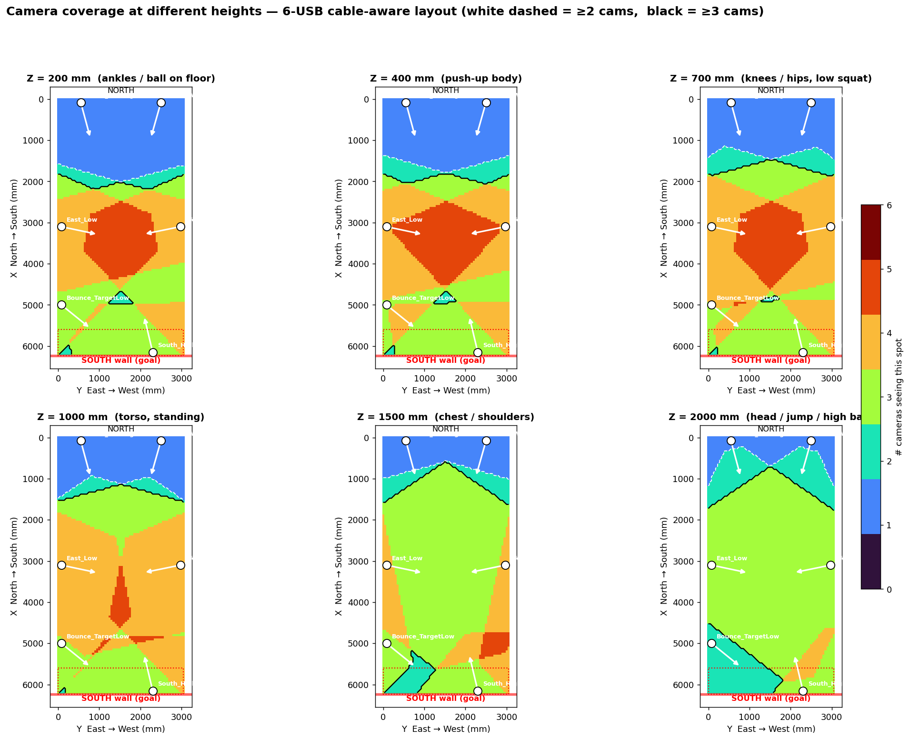

# MultiView-Pose-Predictive-Ballistics

Multi-view pose prediction for vision-guided ball launching.

This repository is the cleaned public portfolio version of my MSc engineering project: a computer-vision system that combines 3D athlete tracking, predictive targeting, movement assessment, and safety-gated robotic ball launching. It focuses on the reusable software: 3D joint analytics, rule-based movement assessment, live training feedback logic, camera-layout analysis, projector target scoring, event logging, and safety gates. Large local assets such as raw videos, model weights, calibration captures, and private work logs are intentionally excluded.

## What This Demonstrates

- Computer vision system design for a real multi-camera arena.
- ML inference integration with YOLO ball detection and YOLO-Pose in the full lab system.
- 3D geometry reasoning: camera frustums, wall projection, multi-view target consensus, and coverage simulation.
- Data-science reporting: confidence scoring, rep segmentation, movement-quality metrics, configurable thresholds, and HTML/JSON/C3D exports.
- ML engineering discipline: tests, package layout, reproducible sample data, CI workflow, and clear separation between public code and large/private artifacts.
- Robotics safety thinking: confidence gates, camera-count gates, decision logging, and launcher command constraints.

## System Summary

The full system uses fixed cameras around a small indoor arena to reconstruct athlete pose and ball position, predict near-future motion, and aim a ball launching machine at selected body joints. This public repository contains the shareable parts of that stack:

| Area | Public code |
| --- | --- |
| Athlete assessment | `src/project_cam/assessment/` |
| Live trainer state and overlay logic | `src/project_cam/assessment/live_trainer/` |
| Closed-loop event logging and safety gates | `src/project_cam/closed_loop/` |
| Projector target/grid scoring logic | `src/project_cam/projector/` |
| Camera layout and coverage analysis | `scripts/` |
| Sample motion data and generated reports | `data/raw/`, `data/reports/` |
| Tests | `tests/` |

## Results Snapshot

Representative lab results from the full system:

| Capability | Result |
| --- | --- |
| Static ball localization | 95.17 mm mean error after correction |
| Joint-touch localization | 143.38 mm mean error in thesis validation |
| YOLO-Pose acceleration | 6.2 ms TensorRT FP16 inference, about 6x faster than the MMPose fallback |
| Ball detector hard-case improvement | Jump sequence detection rate improved from 74.9% to 84.2% after model upgrade |
| Assessment export | JSON, HTML, and C3D reports from the same motion session |

The numbers above come from the private lab validation artifacts; the public repo includes the software modules and anonymized sample outputs needed to inspect the implementation style.

## Visual Artifacts

Camera-layout and coverage outputs are included in `docs/figures/`.



## Quick Start

```bash
python -m venv .venv
source .venv/bin/activate
python -m pip install --upgrade pip
python -m pip install -e ".[dev]"
pytest
```

Generate a sample offline athlete-assessment report:

```bash
python -m project_cam.assessment.offline_assess \
  --input data/raw/athlete_001_squat_clean.jsonl \
  --exercise squat \
  --athlete-id athlete_001 \
  --age 10 \
  --sex male \
  --fps 15 \
  --session-id demo_squat_clean \
  --output data/reports/demo_squat_clean_report.json \
  --html-output data/reports/demo_squat_clean_report.html \
  --c3d-output data/reports/demo_squat_clean_report.c3d \
  --calibration-report data/reports/athlete_001_pre_session_calibration.json
```

Regenerate the camera coverage heatmap:

```bash
python scripts/render_coverage_heatmap.py
```

Run the camera-layout simulator:

```bash
python scripts/visualize_camera_coverage.py --layout six_usb_cable_aware
```

## Repository Layout

```text
MultiView-Pose-Predictive-Ballistics/
├── apps/                  # Thin CLI wrappers for assessment workflows
├── configs/               # Exercise rules, calibration targets, projector geometry
├── data/                  # Anonymized sample inputs and generated reports
├── docs/                  # SOPs, hardware notes, and visual figures
├── firmware/              # ESP32 launcher firmware snapshot
├── scripts/               # Camera coverage and layout analysis
├── src/project_cam/       # Python package namespace
└── tests/                 # Unit and workflow tests
```

## Notes For Reviewers

Start with these files if you are reviewing the project for a Data Science, Computer Vision, or ML Engineering role:

- `src/project_cam/assessment/reports.py` - report construction and movement-quality scoring.
- `src/project_cam/assessment/segmentation.py` - rep detection and rejection logic.
- `src/project_cam/assessment/live_trainer/` - live state machine, overlay, and keypoint stabilization.
- `src/project_cam/closed_loop/safety_gates.py` - confidence and camera-count gates before actuation.
- `src/project_cam/projector/static_grid_goal_logic.py` - wall projection and target consensus.
- `scripts/visualize_camera_coverage.py` - geometric camera coverage simulation.
- `tests/` - regression tests for assessment, exports, event logging, safety gates, and projector logic.

## Scope And Limitations

This public repository does not include raw recordings, private calibration captures, trained model weights, TensorRT engines, or the full lab work log. Those assets are large and environment-specific. The code is structured so the core analytics can be reviewed and tested without the lab hardware.

The live robotics loop was validated in a controlled lab setup. Fully autonomous moving-subject firing remains a safety-critical integration boundary and is treated conservatively.
